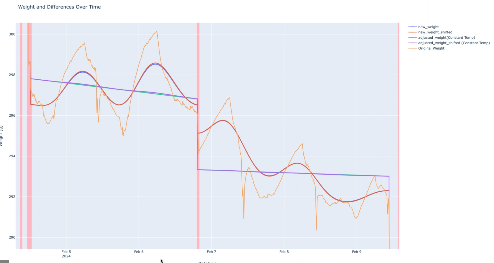

# Load Cell Temperature Compensation

[](https://www.python.org/downloads/)
[](https://opensource.org/licenses/MIT)

**Turn a $10 load cell into a precision instrument with software-based temperature compensation.**



*Orange: raw measurements drifting with temperature. Purple: compensated output, stable across temperature swings.*

## Results

| Metric | Before | After |
|--------|--------|-------|
| **Weight Stability (std)** | 0.620g | **0.105g** |
| **Improvement** | — | **5.9×** |

- **21-day test**, 8.7°C temperature swing (13.8°C–22.5°C)
- **95% median improvement** across 39 stable segments
- **10–25× better than manufacturer spec** (typical: 1–2.5g drift per 10°C)

**Hardware**: CZL611CD load cell (~$10) + HX711 ADC

## Installation

```bash
pip install loadcell-temp-compensation
```

Or from source:
```bash
git clone https://github.com/kim5jk/loadcell-temp-compensation.git
cd loadcell-temp-compensation
pip install -e .
```

## Quick Start

```python
from loadcell_temp_comp import TemperatureCompensator

comp = TemperatureCompensator()
result = comp.fit_transform(
    timestamps=df['datetime'],
    weights=df['weight_g'],
    temperatures=df['temperature']
)

print(f"Raw: {df['weight_g'].std():.3f}g → Compensated: {result['adjusted_weight'].std():.3f}g")
```

## How It Works

Load cells drift with temperature due to thermal expansion of strain gauges and adhesives. Even "temperature-compensated" cells need software correction for precision work.

**Our approach: Segment-based linear regression**

1. **Detect stable segments** — identify periods between weight changes (threshold: ΔW > 0.4g)
2. **Smooth signals** — Gaussian filter on temperature and weight
3. **Fit per-segment** — linear model: `ΔW = slope × ΔT`
4. **Normalize** — adjust all weights to reference temperature (default: 20°C)

**Why this works**: Each segment gets its own calibration, adapting to sensor non-linearity without complex thermal models.

## Comparison

| Approach | Complexity | Result |
|----------|------------|--------|
| Hardware compensation | $$$ | Built-in, limited |
| Hiveeyes thermal inertia | Medium | ±2g, requires τ calibration |
| **This library** | **Simple** | **0.105g std, auto-adapts** |

## API

```python
TemperatureCompensator(
    sigma_temp=30,           # Smoothing for temperature
    sigma_weight=30,         # Smoothing for weight
    drift_threshold=0.4,     # Segment detection threshold (g)
    reference_temperature=20.0,  # Normalization target (°C)
    detrend_threshold=0.5    # Long-term drift threshold (g/day)
)
```

**Methods**:
- `fit_transform(timestamps, weights, temperatures)` — fit and compensate
- `get_segment_stats()` — per-segment calibration details
- `get_summary()` — overall improvement statistics

## Validation

21-day test with ~340g static load, ~5.5 min sampling interval:

| Improvement Level | Segments |
|-------------------|----------|
| >90% | 22 (56%) |
| >80% | 31 (79%) |
| >50% | 36 (92%) |
| Degradation | 0 (0%) |

## Contributing

Contributions welcome:
- Thermal inertia model for rapid temperature changes
- Hyperparameter auto-tuning
- Real-time streaming support
- Additional sensor types (pH, pressure, etc.)

## References

- [Hiveeyes Beehive Scale](https://community.hiveeyes.org/t/more-on-load-cell-temperature-compensation/4391)
- [Yoctopuce Drift Compensation](https://www.yoctopuce.com/EN/article/load-cell-temperature-drift-compensation)
- [Phidgets Load Cell Correction](https://www.phidgets.com/?view=articles&article=LoadCellCorrection)

## License

MIT — see [LICENSE](LICENSE)

---

**Jueseok Kim** · University of Cincinnati, Mechanical Engineering Ph.D. Candidate
